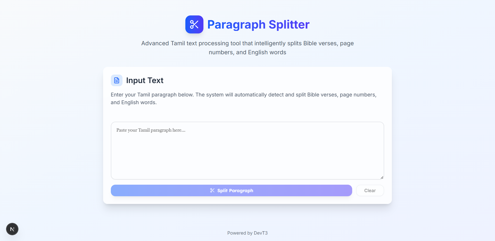

# ✂️ Paragraph Splitter

A sophisticated web application for intelligently splitting Tamil text, with special focus on processing Bible verses, page numbers, and English words. Built with Next.js and TypeScript for a modern, responsive user experience.



## ✨ Features

### 🎯 Smart Text Processing
- **Bible Verse Detection**: Automatically identifies and separates Bible verse references (e.g., `(John 3:16)`)
- **Page Number Extraction**: Recognizes and isolates page numbers in square brackets (e.g., `[42]`)
- **English Word Isolation**: Detects and separates English words in parentheses (e.g., `(word)`)
- **Tamil Text Segmentation**: Intelligently splits regular Tamil text content

### 🎨 Modern UI/UX
- **Beautiful Interface**: Clean, modern design with gradient backgrounds and smooth animations
- **Responsive Design**: Works seamlessly on desktop and mobile devices
- **Tamil Font Support**: Optimized for Tamil text with Tiro Tamil font
- **Interactive Elements**: Hover effects, loading states, and smooth transitions

### 🛠️ Technical Features
- **Copy to Clipboard**: Individual segment copying and bulk copy functionality
- **Real-time Processing**: Instant text splitting with visual feedback
- **Error Handling**: Comprehensive error handling with user-friendly messages
- **Performance Optimized**: Efficient regex-based processing for large text inputs

## 🚀 Quick Start

### Prerequisites
- Node.js 18+
- npm or yarn

### Installation

```bash
# Clone the repository
git clone <your-repo-url>
cd paragraph-splitter

# Install dependencies
npm install

# Start development server
npm run dev
```

Open [http://localhost:3000](http://localhost:3000) to see the application running.

### Production Build

```bash
# Build for production
npm run build

# Start production server
npm start
```

## 📋 Usage

1. **Input Text**: Paste your Tamil text containing Bible verses, page numbers, or English words into the textarea
2. **Split**: Click the "Split Paragraph" button to process the text
3. **Review Results**: View the intelligently separated segments with automatic categorization
4. **Copy**: Use individual copy buttons or "Copy All" to export the processed text

### Example Input
```
இது ஒரு மாதிரி உரை [42] இதில் (John 3:16) மற்றும் (Genesis 1:1-5) போன்ற வசனங்கள் உள்ளன. இவை தனித்தனியாக பிரிக்கப்படும் (word) இந்த உரையில்.
```

### Example Output
- **Text Segment**: `இது ஒரு மாதிரி உரை`
- **Page Number**: `[42]`
- **Verse Reference**: `(John 3:16)`
- **Verse Reference**: `(Genesis 1:1-5)`
- **Text Segment**: `மற்றும் வசனங்கள் உள்ளன. இவை தனித்தனியாக பிரிக்கப்படும்`
- **English Word**: `(word)`
- **Text Segment**: `இந்த உரையில்.`

## 🏗️ Technology Stack

### Frontend Framework
- **Next.js 15** - React framework with App Router
- **React 19** - UI library
- **TypeScript** - Type-safe development

### Styling & UI
- **Tailwind CSS 4** - Utility-first CSS framework
- **shadcn/ui** - High-quality React components
- **Lucide React** - Beautiful icon library
- **Google Fonts** - Tiro Tamil, Inter, and Lexend fonts

### Development Tools
- **ESLint** - Code linting
- **PostCSS** - CSS processing
- **tsx** - TypeScript execution
- **Nodemon** - Development server auto-restart

## 📁 Project Structure

```
paragraph-splitter/
├── src/
│   ├── app/                 # Next.js App Router
│   │   ├── globals.css      # Global styles
│   │   ├── layout.tsx       # Root layout
│   │   ├── page.tsx         # Main page component
│   │   └── favicon.ico      # App icon
│   ├── components/
│   │   ├── ui/             # shadcn/ui components
│   │   │   ├── button.tsx
│   │   │   ├── card.tsx
│   │   │   ├── textarea.tsx
│   │   │   └── toast.tsx
│   │   └── toaster.tsx
│   └── hooks/
│       └── use-toast.ts     # Toast notification hook
├── public/                  # Static assets
│   ├── logo.svg
│   └── robots.txt
└── server.ts               # Custom server configuration
```

## 🎯 How It Works

The application uses sophisticated regular expressions to identify different types of content:

1. **Verse References**: Detects patterns like `(Book Chapter:Verse)` with support for ranges
2. **Page Numbers**: Identifies square bracket enclosed numbers `[42]`
3. **English Words**: Recognizes parenthesized alphabetic strings `(word)`
4. **Text Segments**: Splits regular text at detected boundaries

The processing algorithm preserves the original text while intelligently separating structured content for better readability and processing.

## 🚀 Deployment

### Netlify (Recommended)
This project is configured for easy deployment on Netlify:

```bash
# Build the project
npm run build

# Deploy to Netlify
# Connect your repository to Netlify for automatic deployments
```

### Manual Deployment
```bash
# Build static files
npm run build

# Serve static files
npm run serve:static
```

## 🤝 Contributing

1. Fork the repository
2. Create a feature branch (`git checkout -b feature/amazing-feature`)
3. Commit your changes (`git commit -m 'Add amazing feature'`)
4. Push to the branch (`git push origin feature/amazing-feature`)
5. Open a Pull Request

## 📝 License

This project is open source and available under the [MIT License](LICENSE).

## 🙏 Acknowledgments

- **Tiro Tamil Font** - For beautiful Tamil typography support
- **shadcn/ui** - For the amazing component library
- **Next.js** - For the robust React framework
- **Tailwind CSS** - For the utility-first CSS approach

---

Built with ❤️ for Tamil text processing. Powered by DevT3.
